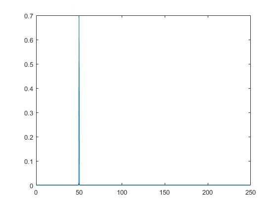
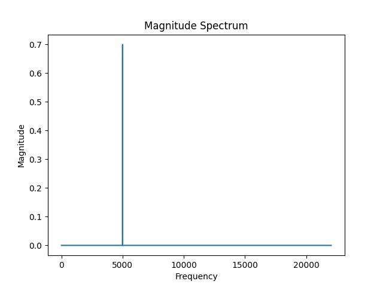

numpy-fft-playground
====================
- [How to Do FFT in MATLAB - YouTube](https://www.youtube.com/watch?v=XEbV7WfoOSE)
- [Discrete Fourier Transform (numpy.fft) — NumPy v1.26 Manual](https://numpy.org/doc/stable/reference/routines.fft.html)

### Matlab

### numpy

### Notes
- Some discrete signal DOES NOT depend on sampling Frequency:
  - Hard-coded signals
  - Constant signals
  - Random signals
- Some discrete signal DOES depend on sampling Frequency:
  - Sampled signal (audio)
  - parametic signal (math functions like sin / cos / etc.)
- For `fft()` operation, we just need 1d array of y values (aka voltage)
- Sampling Frequency affects the frequency range
  - Nyquist–Shannon sampling theorem
    - chop the DFT output by "half" (the upper half is aliasing)
      - if N is odd
        - ceil(N / 2)
      - if N is even
        - (N/2) + 1
- Bigger the N, the narrower each freq bin (more bin)
  - can append zeros for make N bigger
    - no problem because DFT tells the pure sin waves components
      - zeros does not belong to any pure sin waves
      - the real data still have the same pure sin waves components
- In radian (phase mode) we usually do not calculate pi as 3.14
  - usually we just see it as 180 degree (if we need to calculate phase)
    - otherwise just leave pi as it is
  - In programming we indeed let programming language evalute pi as 3.14 all the time
    - it is becuase normally programming language do not do symbolic calculation (leave pi as it is even in computation result)
    - Computers always look for numeric data for the primitive data type
    - and we can always normalize the numeric representation by dividing pi again
      - x / 3.14 = ? (unit is pi)
        - if ? is 2, then we can read as 360 degree
